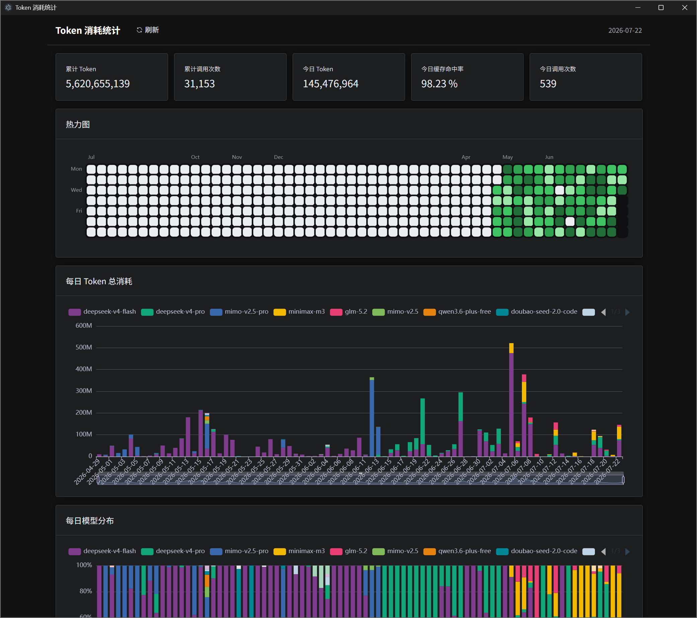
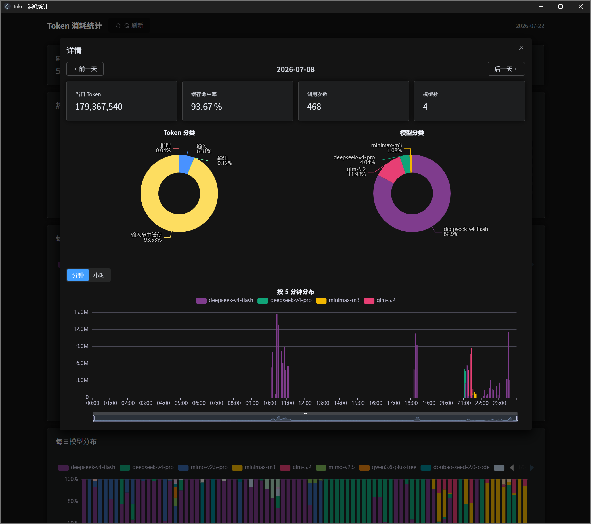

# Token Consumption

实时聚合 **pi** 和 **opencode** 两个 AI coding agent 的 token 消耗统计。




## 功能

- **累计 / 今日 Token 卡片** — 总量、调用次数、缓存命中率一目了然
- **热力图** — 7×52 网格，GitHub 风格，显示整年每日用量；点击查看详情
- **每日 Token 总消耗** — 按模型堆叠柱状图，支持缩放联动
- **每日模型分布** — 100% 堆叠，展示各模型占比变化

### 详情弹窗

点击任意一天弹出：
- 当日统计卡片（总量、缓存命中率、调用次数、模型数）
- Token 分类饼图（输入/输出/缓存/推理）
- 模型分布饼图
- 按 5 分钟 / 按小时堆叠柱状图
- 前一天 / 后一天导航

## 数据源

| 来源 | 路径 |
|---|---|
| **pi** | `~/.pi/agent/sessions/**/*.jsonl` |
| **opencode** | `~/.local/share/opencode/opencode.db` |

数据实时读取，每 60 秒自动刷新。

## 技术栈

- **桌面框架**: Electron 32
- **UI**: Vue 3 + Element Plus (暗色模式)
- **图表**: Apache ECharts
- **构建**: electron-vite
- **打包**: electron-builder (NSIS)

## 快速开始

```bash
npm install
npm run dev    # 开发模式（HMR）
```

## 打包

```bash
npm run build          # 构建到 out/
npm run package        # 输出 NSIS .exe（需网络下载 Electron 二进制）
node scripts/portable  # 离线可移植版
```

## 项目结构

```
token-consumption/
├── DESIGN.md                  # 完整设计文档
├── src/
│   ├── main/                  # Electron 主进程
│   │   ├── index.ts           # 入口 + IPC
│   │   └── data/              # 数据层
│   │       ├── pi.ts          # 读 pi jsonl
│   │       ├── opencode.ts    # 读 opencode db
│   │       └── aggregate.ts   # 聚合
│   ├── preload/               # contextBridge
│   ├── renderer/              # Vue 3 应用
│   │   ├── components/        # TopStats, Heatmap, DailyTokens 等
│   │   ├── composables/       # useData, useSelection, modelColor
│   │   └── charts/            # ECharts option 构建器
│   └── shared/types.ts
└── scripts/portable.ts        # 便携版构建脚本
```

## 许可

MIT
